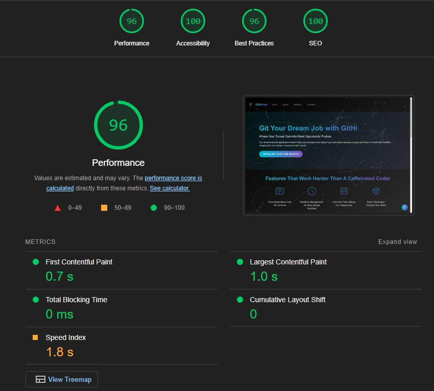

<div align="center">
  <h1><strong>ELEVATE 2024</strong></h1>
  <p>This project was made as an entry to <strong>Elevate</strong> Hackathon, October 2024, organized by 
  </p>

  

  
  
  
  
  
</div>

# Git Hired 🚀

## Because your job hunt shouldn't feel like searching for a needle in a digital haystack!

Welcome to Git Hired, your new best friend in the job application jungle. Born in the crucible of the Elevate Hackathon, Git Hired is here to turn your job search from a chaotic mess into a well-oiled machine. (We can't guarantee you'll get hired, but at least you'll know where you applied!)

The project is deployed and can be accessed at: https://jobtracker-team4-b6fdc54fc148.herokuapp.com/

## Table of Contents
- [User Stories](#user-stories)
- [Features](#features)
- [Installation](#installation)
- [Usage](#usage)
- [API Documentation](#api-documentation)
- [Contributing](#contributing)
- [The Dream Team](#the-dream-team)
- [License](#license)
- [Entity Relationship Diagram (ERD) Design](#entity-relationship-diagram-erd-design)
- [Wireframes](#wireframes)
- [Performance](#performance)
- [Technologies Used](#technologies-used)
- [Frameworks](#frameworks)
- [Supporting Libraries and Packages](#supporting-libraries-and-packages)
- [Code Validation](#code-validation)
- [CSS Validation](#css-validation)
- [Acknowledgements](#acknowledgements)


# User Stories

1. **As a job seeker**, I want to enter my job title so that I can generate relevant interview questions tailored to my role.

2. **As a job seeker**, I want to view a list of generated interview questions after submitting my job title.

3. **As a job seeker**, I want to provide my answers to the generated questions and submit them for evaluation.

4. **As a user**, I want to see AI-generated feedback on my answers.

5. **As a user**, I want to revisit previously generated questions and answers.

6. **As an administrator**, I want to manage user submissions and feedback.

7. **As a new user**, I want an intuitive interface that guides me through the process.

8. **As a user**, I want to receive success messages after successfully generating questions or submitting answers.

[Return to Table of Contents](#table-of-contents)


## Features

- **Application Tracking**: Keep tabs on your job applications like a pro stalker (but legal and for your own stuff).
- **Dashboard View**: Get a bird's eye view of your job hunt. It's like Google Maps, but for your career!
- **Search and Filter**: Find that one application faster than you can say "I'm perfect for this job!"
- **Status Updates**: From "Applied" to "Hired" (or "They ghosted me"), track it all.
- **Notes and Comments**: For when you need to remember that the interviewer had a cat named "Mr. Whiskers" (it might be important, you never know).
- **Analytics**: Impress your friends with fancy graphs about your job search. Who said unemployment can't be fun?

### Homepage


[Return to Table of Contents](#table-of-contents)

## Installation

1. Clone the repo:
   ```
   git clone https://github.com/your-username/git-hired.git
   ```
2. Navigate to the project directory:
   ```
   cd git-hired
   ```
3. Install dependencies:
   ```
   pip install -r requirements.txt
   ```
4. Set up the database:
   ```
   python manage.py migrate
   ```
5. Start the server:
   ```
   python manage.py runserver
   ```

[Return to Table of Contents](#table-of-contents)

## Usage

1. Create an account (we promise we won't sell your data to job recruiters... or will we? 👀)
2. Log in and start adding your job applications
3. Use the dashboard to track your progress
4. Update application statuses as you go
5. Celebrate when you finally Git Hired! 🎉

[Return to Table of Contents](#table-of-contents)

## API Documentation

For those who like to peek under the hood, check out our [API documentation](link-to-your-api-docs).

[Return to Table of Contents](#table-of-contents)

## Contributing

We welcome contributions! Please check out our [Contributing Guide](link-to-contributing-guide) for details on how to get started. Don't worry, we don't bite (unless you write bugs, then we might nibble a little).

[Return to Table of Contents](#table-of-contents)

## The Dream Team

Meet the caffeinated coders behind Git Hired:

### Vasi "The Visionary" 👁️
- Frontend Maestro
- Turns caffeine into pixel-perfect UIs
- [GitHub](https://github.com/Vasileios20) | [LinkedIn](https://www.linkedin.com/in/vasileios-tsimourdagkas/)

### Erin "The Energizer" ⚡
- Full Stack Dynamo
- Codes faster than the speed of light (almost)
- [GitHub](https://github.com/erinvdoyle) | [LinkedIn](https://www.linkedin.com/in/erinvdoyle)

### David "The Debugger" 🐛
- Backend Sorcerer
- Can smell a bug from a mile away
- [GitHub](https://github.com/trxdave) | [LinkedIn](www.linkedin.com/in/david-cotter-junior-software-developer)

### Ciaran "The Connector" 🔗
- API Alchemist
- Connects dots and databases with equal ease
- [GitHub](https://github.com/ciarangriffin93) | [LinkedIn](https://www.linkedin.com/in/ciaran-griffin-2534622a5/)

### Marlon "The Mastermind" 🧠
- Architecture Aficionado
- Builds systems that even Skynet would envy
- [GitHub](https://github.com/Markpm-code) | [LinkedIn](https://www.linkedin.com/in/marlon-mandaya-544172234/)

### Kim "The Kode Whisperer" 🤫
- UX/UI Enchanter
- Makes our app look prettier than your Instagram feed
- [GitHub](https://github.com/kimatron) | [LinkedIn](https://www.linkedin.com/in/kimhanlon291354/)

[Return to Table of Contents](#table-of-contents)

## License

This project is licensed under the MIT License - see the [LICENSE.md](LICENSE.md) file for details. (It's MIT because we're too busy job hunting to write our own license.)

---

Remember, in the world of job hunting, it's not about the destination, it's about the journey. And with Git Hired, at least that journey will be well-documented! Happy job hunting! 🎉

[Return to Table of Contents](#table-of-contents)

## Entity-Relationship Diagram (ERD) Design

This ERD outlines the database schema for the Git Hired application. It includes three main models: Job, Goal, and Note, each associated with the User model.

Job: Represents job applications, including details such as the category, company, title, location, application status, and the date applied.
Goal: Tracks user-defined career goals.
Note: Allows users to add notes related to specific job applications, with timestamps for creation and updates.

The relationships between the models are defined as follows:

A User can have multiple Jobs and Goals.
Each Job can have multiple associated Notes.


[Return to Table of Contents](#table-of-contents)

### Wireframes

* We used [Balsamiq](https://balsamiq.com/wireframes) to design the wireframes for us website.

#### Desktop:
<details>


</details>

[Return to Table of Contents](#table-of-contents)

## Performance

The Git Hired website was assessed with Google Lighthouse via Google Chrome Developer Tools. Performance scores were evaluated for both desktop and mobile devices.

### Desktop Performance
- The average score for the pages was 90/100 and the majority of the pages getting an excellent performance of over 90/100

| **Tested** | **Performance Score** | **View Result** | **Pass** |
--- | --- | --- | :---:
|homepage| 100 / 100 | <details><summary>Screenshot of result</summary></details> | :white_check_mark:
|about| 85 / 100 | <details><summary>Screenshot of result</summary></details> | :white_check_mark:
|Job Application| 99 / 100 | <details><summary>Screenshot of result</summary></details> | :white_check_mark:
|Practice| 74 / 100 | <details><summary>Screenshot of result</summary></details> | :white_check_mark:


### Mobile Performance
- The average score for the pages was 80/100 and the majority of the pages getting an good performance of 70/100

| **Tested** | **Performance Score** | **View Result** | **Pass** |
--- | --- | --- | :---:
|homepage| 95 / 100 | <details><summary>Screenshot of result</summary></details> | :white_check_mark:
|about| 85 / 100 | <details><summary>Screenshot of result</summary></details> | :white_check_mark:
|Job Application| 99 / 100 | <details><summary>Screenshot of result</summary></details> | :white_check_mark:
|Practice| 74 / 100 | <details><summary>Screenshot of result</summary></details> | :white_check_mark:

[Return to Table of Contents](#table-of-contents)

## Technologies Used

### Languages

- <strong>HTML:</strong> Used for structuring the content on the web pages. It forms the backbone of the project, ensuring that all elements are correctly placed and accessible.

- <strong>CSS:</strong> Used for styling the HTML elements, providing the visual appearance and layout of the web pages. CSS ensures the platform is visually appealing and user-friendly.

- <strong>JavaScript: </strong>Adds interactivity and dynamic behavior to the web pages. It enhances the user experience by allowing for real-time updates, form validations, and interactive elements.

- <strong>Python:</strong> a primary programming language for the backend of the project. It is used in conjunction with the Django framework to handle server-side logic, data processing, and integration with the database.

[Return to Table of Contents](#table-of-contents)

### Frameworks

- <strong>Django:</strong> A high-level Python web framework that encourages rapid development and clean, pragmatic design. It provides robust features for building the backend, including user authentication, URL routing, and database management, ensuring a scalable and secure web application.

[Return to Table of Contents](#table-of-contents)

### Supporting Libraries and Packages

- <strong>Bootstrap:</strong> As a popular CSS framework that helps in designing responsive and mobile-first web pages, we used it to ensure the directory is accessible and visually consistent across different devices and screen sizes.

[Return to Table of Contents](#table-of-contents)

## Code Validation

### HTML Validation
ll pages were validated, and the code was pasted in. A filter was applied to remove issues related to the Django templating system. 

| **Tested** | **Result** | **View Result** | **Pass** |
--- | --- | --- | :---:
|base| No errors | <details><summary>Screenshot of result</summary></details>| :white_check_mark:
|index| No errors | <details><summary>Screenshot of result</summary></details>| :white_check_mark:
|about| No errors | <details><summary>Screenshot of result</summary></details>| :white_check_mark:
|Job Application| No errors | <details><summary>Screenshot of result</summary></details>| :white_check_mark:
|Practice| No errors | <details><summary>Screenshot of result</summary></details>| :white_check_mark:
|Add Note| No errors | <details><summary>Screenshot of result</summary></details>| :white_check_mark:
|Challenge Detail| No errors | <details><summary>Screenshot of result</summary></details>| :white_check_mark:
|Challenge List| No errors | <details><summary>Screenshot of result</summary></details>| :white_check_mark:
|Code Submission| No errors | <details><summary>Screenshot of result</summary></details>| :white_check_mark:
|Job Dashboard| No errors | <details><summary>Screenshot of result</summary></details>| :white_check_mark:
|Job Form| No errors | <details><summary>Screenshot of result</summary></details>| :white_check_mark:
|Note| No errors | <details><summary>Screenshot of result</summary></details>| :white_check_mark:
|Update Job Application| No errors | <details><summary>Screenshot of result</summary></details>| :white_check_mark:

[Return to Table of Contents](#table-of-contents)

### CSS Validation

| **Tested** | **Result** | **View Result** | **Pass** |
--- | --- | --- | :---:
|styles.css | No errors |<details><summary>Screenshot of result</summary></details>| :white_check_mark:
|interview.css | No errors |<details><summary>Screenshot of result</summary></details>| :white_check_mark:
|job_application.css | No errors |<details><summary>Screenshot of result</summary></details>| :white_check_mark:

[Return to Table of Contents](#table-of-contents)

## Acknowledgements

[Ciaran Griffin](https://github.com/ciarangriffin93)<br>
[David Cotter](https://github.com/trxdave)<br>
[Erin Doyle](https://github.com/erinvdoyle)<br>
[Kim Halon](https://github.com/kimatron)<br>
[Marlon Mandaya](https://github.com/Markpm-code)<br>
[Vasilis Tsimourdagkas](https://github.com/Vasileios20)

[Return to Table of Contents](#table-of-contents)